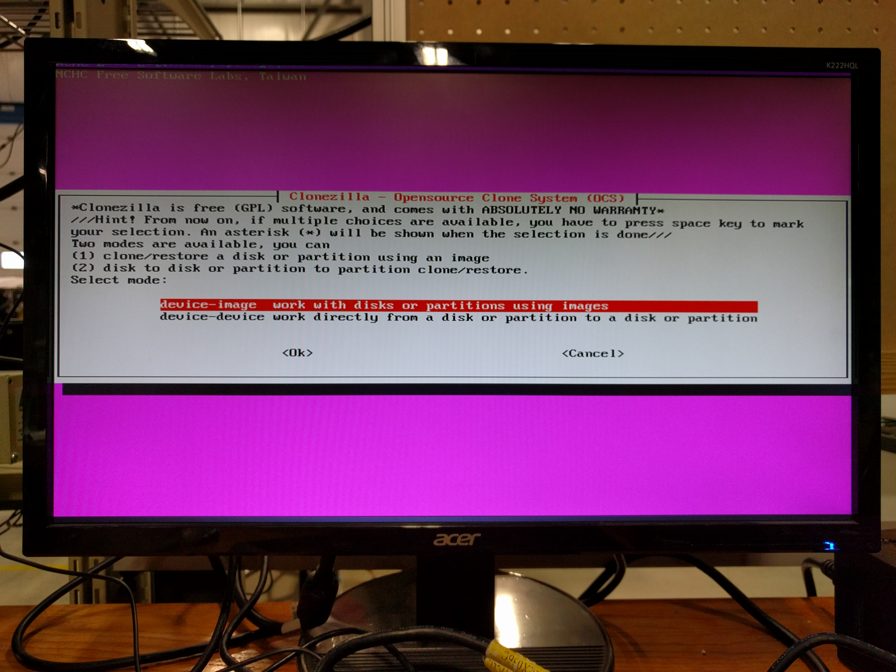
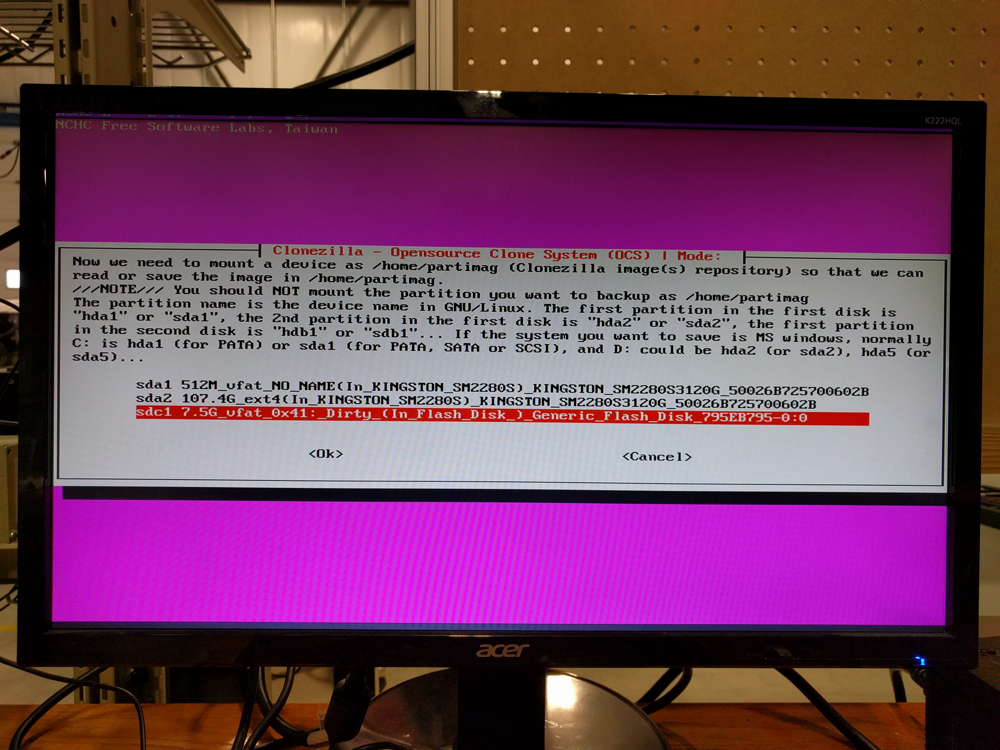

Installing an Image to the NUC
=============================== 

The process to install a previously-cloned image to the NUC is quite simple. All that is required are two USBs.

1. Create a bootable Clonezilla Live USB (http://clonezilla.org/clonezilla-live.php#make).
2. Download the pr2-head tarball from the PR2 packages server (http://www.clearpathrobotics.com/pr2-packages/pr2-releases) and unpack it on another USB.
3. Plug in the USB into the NUC and boot off of the Clonezilla Live USB. Press F10 when the NUC boots up to enter into the boot media menu and select the Clonezilla Live USB.
4. Select the Clonezilla Live setting in the menu and wait for the next menu to show up.

.. image:: clonezilla_photos/start_screen.jpg
    :alt: Clonezilla Live start screen.

5. Select a language to use (use arrow keys and enter).
6. Select "Don't touch keymap" on the "Configuring console-data" menu.
7. Select "Start_Clonezilla".

.. image:: clonezilla_photos/start_clonezilla.jpg
    :alt: Choose how to start Clonezilla.

8. Select "device-image" to clone the image onto your NUC (Note the hint: press space to mark selections on menu with multiple options)

9. Choose "local_dev" from the "Mount Clonezilla image directory" menu.

.. image:: clonezilla_photos/local_dev.jpg
    :alt: Choosing local_dev for where Clonezilla will look for the image.

10. Plug in the non-Clonezilla USB, wait 5 seconds, then press enter.

.. image:: clonezilla_photos/insert_usb.jpg
    :alt: At this screen, insert the other USB.

11. Select the USB from the list of disks. It will be the volume listed as something like "sdb1" or "sdc1".

12. Select the "/" directory from next menu.
13. After a list of information about the disk, press enter then select the "Beginner" option.
14. Select the "restoredisk" option from the next menu. Ensure you select the correct option on this step!

.. image:: clonezilla_photos/restoredisk.jpg
    :alt: The correct option to clone onto the NUC.

15. Select the pr2-head image file and the drive you want to clone the image to, then press enter to continue.
16. Press "y" then enter for the next few prompts.
17. Wait until the process completes by itself.
18. After the process completes, the following screen will show up. Press enter.

.. image:: clonezilla_photos/clone_finish.jpg
    :alt: The ending screen.

19. Select "poweroff" and turn off the NUC. After the NUC is off, remove the two USBs.

.. image:: clonezilla_photos/poweroff.jpg
    :alt: Turning off the NUC.

20. Power on the NUC. You're done! Your NUC should now be fully functional!

.. image:: clonezilla_photos/done.jpg
    :alt: The login screen after rebooting the NUC.
