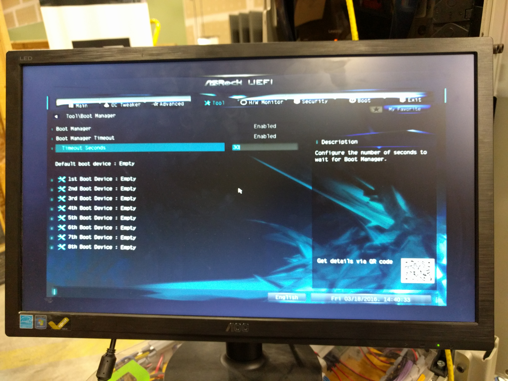
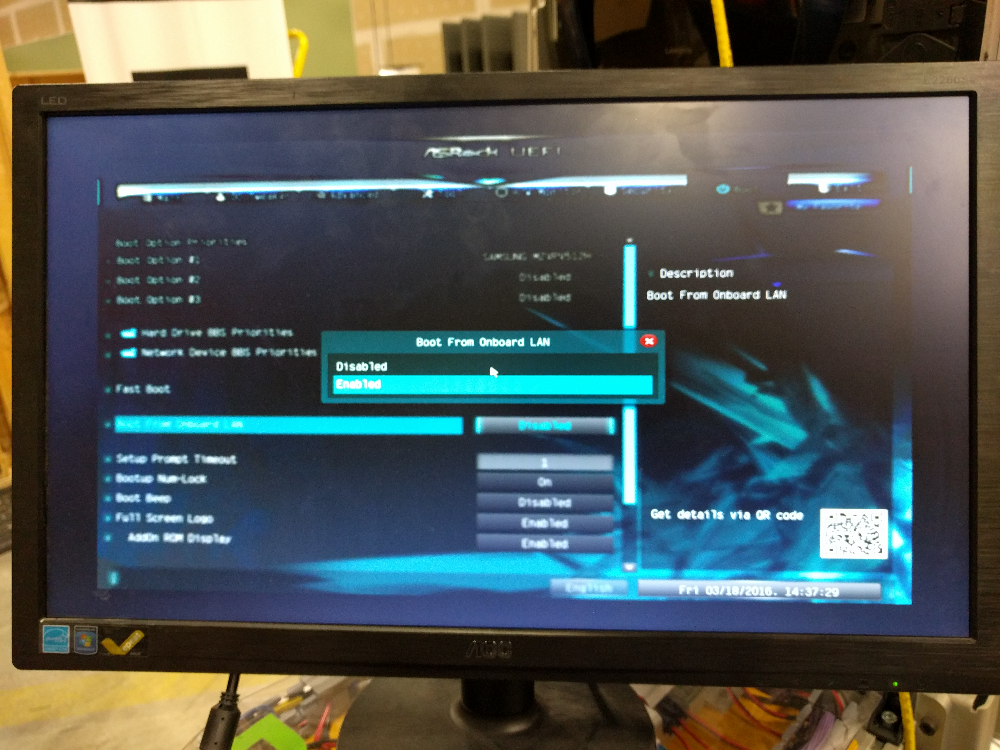

Setting Up the BIOS for Netbooting
==================================  

1. Turn on the computer and as you see the ASRock logo come up on the display, hit F2 repeatedly to enter the UEFI menu.
2. In the UEFI menu, navigate to the "Tools" menu using the left and right arrow keys. Once in the menu, use the up and down arrow keys to get to "Boot Manager" and press enter.

.. image:: BIOS_photos/boot_manager.jpg
    :alt: The Boot Manager setting.

3. In the Boot Manager menu, change "Timeout seconds" to 30 by typing in the box, then press escape to get back to the Tool menu.

4. Using the left and right arrow keys again, navigate to the "Boot" menu.
5. In the Boot menu, go down to "Boot from onboard LAN" and press enter, then enable the setting and press enter again.

6. Next, ensure "Fast boot" is disabled.
7. Go up to the top of the menu and find the "Boot Option Priorities" list. For the first boot option, press enter and set it to "IBA GE Slot ..." to turn on netbooting. Turn off all the other boot options by disabling them.

.. image:: BIOS_photos/boot_options.jpg
    :alt: Enabling "IBA GE Slot ...", or booting from the network card.

8. BIOS setup should be complete at this point. Go to the "Exit" menu and select "Save Changes and Exit" then make sure you select the correct option to save your changes.
