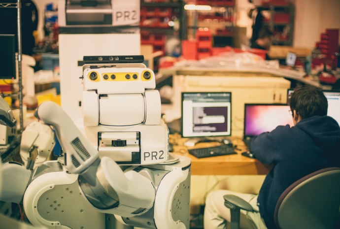

PR2 Tutorials
================

.. toctree::
    :maxdepth: 0

.. toctree::
    :maxdepth: 0
    :caption: Getting Started with PR2 Development

    Resources.rst
    DebuggingPR2Software.rst
    PR2Developer.rst
    BuildingPR2Debians.rst
    ReleasingROSPackage.rst

.. toctree::
    :maxdepth: 0
    :caption: PR2 Support

    WillowGarageTransition.rst
    PR2 Safety.rst
    SubmitSupportTicket.rst
    PR2GoogleGroup.rst
    PR2Downloads.rst
    PR2Repairs.rst

.. toctree::
    :maxdepth: 0
    :caption: PR2 Software

    IndigoChecklist.rst
    ReinstallingPR2.rst
    PR2ServicePortDiagnosis.rst
    UpdatingSourcesList.rst
    ConnectAMonitor.rst
    InstallingROSHydro.rst
    InstallingROSIndigo.rst
    InstallingPR2Trusty.rst
    InstallingPR2TrustyUnsupported.rst
    SettingUpBIOS.rst
    InstallingTheNUC.rst
    ReleaseNotes.rst

